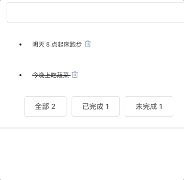

# 通过一个简单的 TODO 项目来练习 ES6 和 Vue
- 希望你通过这个项目不仅练习了常用的 ES6 语法，更熟悉了 Vue 的一些基本 API
- 实际代码算上注释和空行，不到 170 行


## 安装环境
- node 版本需要大于 7.0
- 给 npm 设置 taobao 的 registry
```bash
npm install --registry=https://registry.npm.taobao.org

# 安装 vue-cli 3.x 
npm install -g @vue/cli
```

## 启动项目
``` bash
cd es6-practice

# 安装依赖
npm i

# 启动项目 localhost:3000
npm start
```

## 学习思路
- 先不要着急去看 App.vue 里的源码，启动项目看到效果后，先自己手动实现
- 自己实现后，再对比源码
- 建议理解 App.vue 里的每一行代码，个人觉得这是前端项目里很基础的内容

## 参考资料
- 书籍：[《ES6 标准入门》第三版](http://es6.ruanyifeng.com/)
- 视频教程：[《Promise 入门》](https://www.imooc.com/learn/949)
- 视频教程：[《Vue2.5开发去哪儿网App 从零基础入门到实战项目》](https://coding.imooc.com/class/203.html)（需付费）

## 最后
- 如果你有更好的建议或者遇到一些问题，可在 issues 里提问，或直接 Pull Request
- [提问的智慧](https://github.com/tvvocold/How-To-Ask-Questions-The-Smart-Way)
- [个人博客](https://www.jianshu.com/u/4152d9aab276)
- QQ 交流群 163801325（聊天，斗图，学习，交流。伸手党勿进）
